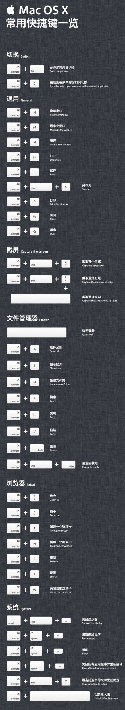

# Mac使用小技巧

[TOC]

## 软件

### 系统支持

- Mounty：NTFS硬盘格式支持
- The Unarchiver：压缩解压
- PaintBrush：画图板
- MplayerX：视频加速播放／多格式支持
- Dr.Cleaner：清理
- Office：文档处理
- Sublime 2：文本编辑
- Typora:md文档书写
- shiftIt 多窗口管理
- LICEcap 录制Gif
- N多手机助手 连接管理Android手机
- go2shell 命令行支持
- ————
- Near Lock：蓝牙解锁
- 坚果云：资料多端同步
- Iterm2：命令行终端
- QQ         
- 微信
- 网易云音乐
- Cheatsheet：查看页面的快捷键
- PdfNut：pdf阅读器

### 开发

- Android Studio
- Eclipse
- Xcode
- SourceTree：版本管理
- SmartSvn
- Sqlite Professional：db文件查看
- DiffMerge：文件对比
- Dash：API查看
- Charles：抓包
- Axure rp：流程图／交互图
- chrome 插件
  - Postman 调试接口
  - Gliffy Diagrams 流程图
  - Vysor 连接手机
  - Json Editor
  - TimeDoser
  - LastPass 密码管理
  - 猫抓
  - crx Mouse 鼠标手势
  - 空格之神
  - 为知笔记
  - Octotree github目录结构

## 技巧

### Finder

1. whitespace 即时预览

2. enter 重命名

3. cmd+z 撤销(几乎可以撤销一切)

4. 在Finder中添加快捷图标：在应用程序的文件夹下按住cmd拖拽图标到Finder的窗口，移除同样是按住cmd键拖拽

5. 选中要整理的文件cmd+control+n 新建文件夹,或者右键选择归类文件

6. 保存文件时,切到桌面 cmd+d

7. 终端中用Finder打开当前目录 open .

8. 快捷推出U盘 cmd+e

9. spotlight中打开文件位置 cmd+enter

10. 显示简介 cmd+i

11. 打开文件 cmd+o

12. cmd + shift + A/U/D/H/C，分别进入Finder的应用程序、实用工具、桌面、个人和电脑文件夹

13. 移动文件 复制文件后cmd+option+v

14. 显示隐藏文件
```
defaults write com.apple.finder AppleShowAllFiles -bool true;killall Finder
```
15. finder标题栏显示完整路径
```
defaults write com.apple.finder _FXShowPosixPathInTitle -bool YES
```
### 系统

1. 全屏 cmd＋control+F

2. 回到桌面 F11

3. 强制退出 cmd+option+esc

4. 息屏 shift＋control＋电源键

5. 修改mac hosts: finder->/private/etc/hosts

6. 关闭Dashboard：defaults write com.apple.dashboard mcx-disabled -boolean YESkillall Dock（在系统设置里mission control里也可以修改关闭掉）

7. 删除设置中的插件图标 option+右键 就会弹出删除选项

8. 显示隐藏Dock cmd+option+d

9. 切换不同APP cmd+tab/~(上/下),切换相同APP不同tab cmd+~,可以cmd+q退出程序

10. 开机启动项 设置-用户与群组-登录项

11. 系统中英文输入法切换 caps lock

12. 移动窗口到另外一个屏幕 (shiftIt) control+alt+cmd+N

13. 打开go2shell偏好

   ```
open -a Go2Shell --args config
   ```

14. 创建可执行脚本
```
#! /bin/bash
echo abc
终端中修改权限 chmod +x 文件.sh
文件拖拽到命令行进行执行
```
15. 修改Launchpad图标行列
```
列 defaults write com.apple.dock springboard-columns -int 8;killall Dock;
行 defaults write com.apple.dock springboard-rows -int 8;killall Dock;
恢复默认 defaults write com.apple.dock springboard-columns -int Default;killall Dock;
```

### 手势

1. 打开launchpad 五指合并
2. 切换桌面 三指左右滑动
3. 切换程序 三指上滑／cmd＋tab
4. 翻译,三指轻点
   
