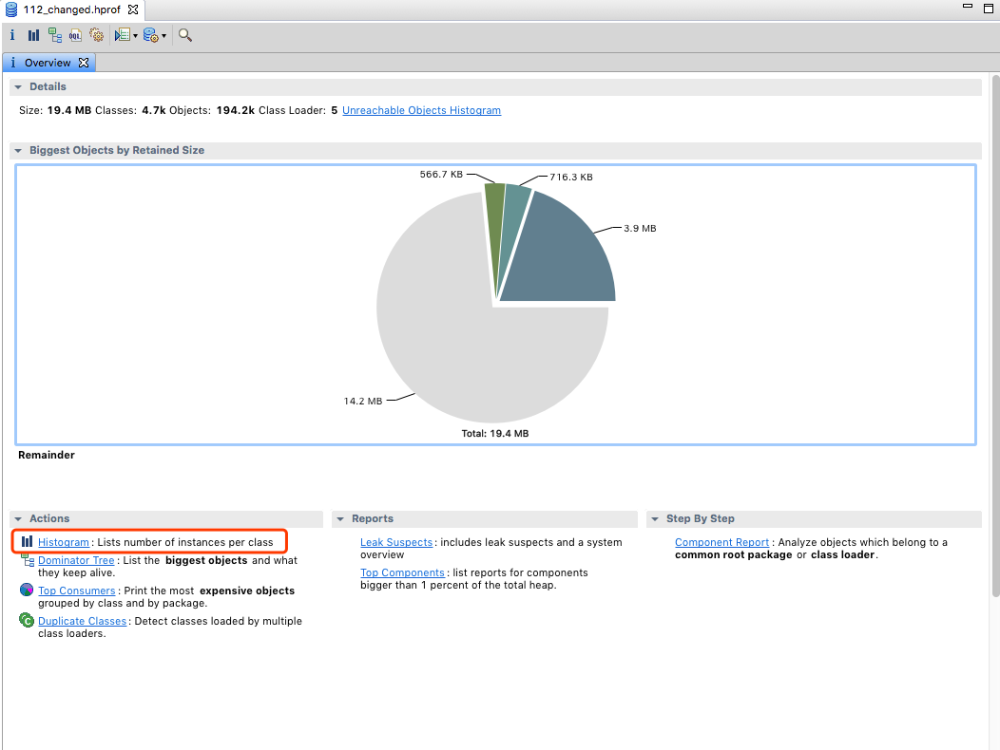
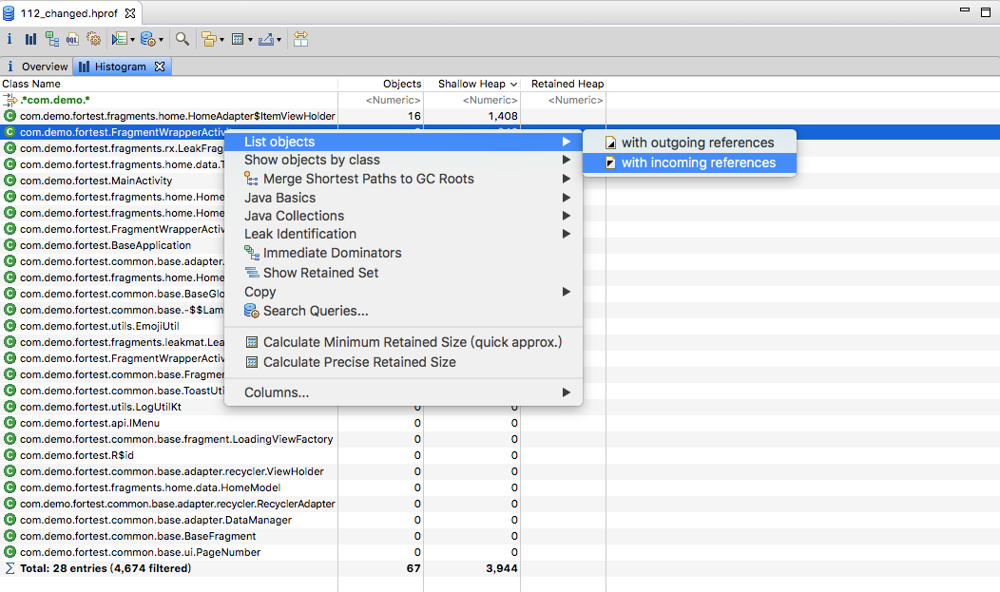
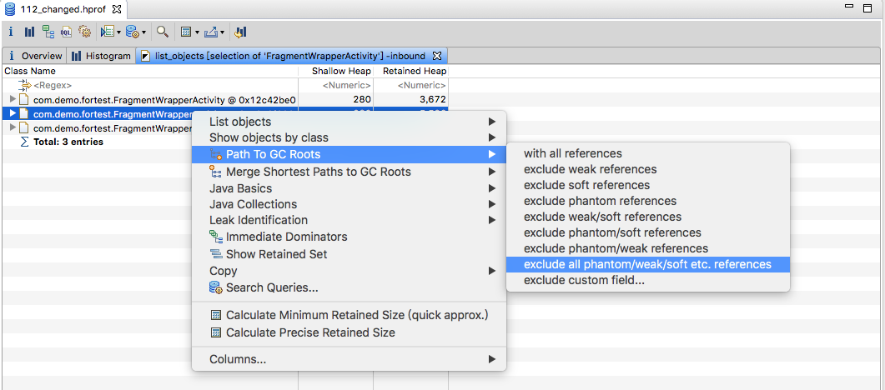
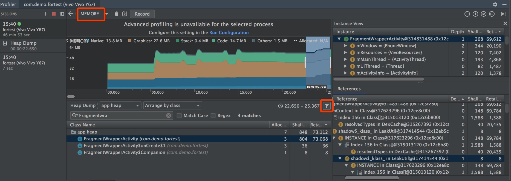

# Android 检查内存泄漏

[TOC]

- MAT [下载](https://www.eclipse.org/mat/downloads.php)

  将 android profile 中的heap 文件导出，使用 `hprof-conv` 命令（该命令在 android sdk/platform-tools/目录）对文件进行转换

  ```shell
  hprof-conv sourceFile outputFile
  ```

  用 MAT 打开转换后的文件,选择 Histogram

  

  

  with incoming reference 被外部对象持有引用

  

  不包括所有弱引用，虚引用，平台相关的引用

- Android Profile

  打开 Android Studio（3.3.2 版本） 中 View-> Tool Windows->Profile

  选择 MEMORY 选项，手机端操作完成之后，点击 Dump java Heap

  

  

- Leak Canary [地址](https://github.com/square/leakcanary)

## 对比

Android Profile 和 MAT 分析相对比较没有头绪，要一个个类去查是否泄漏

Leak Canary 是出现了泄漏则出现告警，使用起来更加简单方便，内存泄漏分析的初衷是定位泄漏的原因并修复，降低应用的内存占用。如果检查泄漏的方法效率低下，只作为了解即可。所以更推荐leak canary