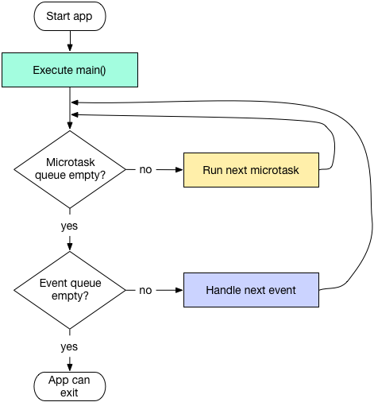

# Dart

[TOC]

## 语法

- Hello  World

  ```flutter
  void main() {
    print('Hello, World!');
  }
  ```

- 定义变量，得益于类型推断，不需要明确类型

  ```
  var name = 'Voyager I';
  var year = 1977;
  var antennaDiameter = 3.7;
  var flybyObjects = ['Jupiter', 'Saturn', 'Uranus', 'Neptune'];
  var image = {
    'tags': ['saturn'],
    'url': '//path/to/saturn.jpg'
  };
  // 如果一个变量不局限于一个类型，则可以用 dynamic
  dynamic name = 'Bob';
  // 没有初始化的变量默认值都是 null，即使像数字类型的变量初始值也是 null，因为在 Dart 中所有的东西都是 objects
  ```

- 基本数据类型 num String bool List Map

  ```
  // num String bool List Map
  // num 有 int 和 double 两种类型 int -2^53 到 2^53 ，double 64 长度的双精度浮点型
  int n1 = 10;
  double n2 = 20.5;
  num n3 = 25.4;
  var n4 = 11.2;
  // String 使用 单引号 双引号 三引号 (其中双引号和三引号用来表示大文本块)
      String s1 = 'jack';
      String s2 = "这也是个大文本块"
          "随便填写数据"
          "看看效果";
      String s3 = '''
      这是个大文本块,随便填写数据
      ''';
  // Dart 是 bool 强类型检查 只有 bool 的值是 true，才被认定为 true，非 0 或者字符串等不能被认定 true
  bool b1 = true;
  
  var list2 = List();
  var list3 = [];
  
  var map2 = Map();
  var map3 = {};
  ```

- 运算符

  ```
  // 和 java 的类似，特别说明一个除法
  print(1/0); // Infinity
  print(1~/0); // IntegerDivisionByZeroException ~/ 表示计算整数结果
  //   / 默认返回的是浮点数
  ```

- static final 和 const

  ```
  // static修饰符的使用方式和Java类似。 static变量直到运行期被使用时才会实例化
  final name = 'Bob'; // Without a type annotation
  final String nickname = 'Bobby';
  // final 用于修饰变量 表示单赋值(single-assignment)
  var foo = const [];
  final bar = const [];
  const baz = []; // Equivalent to `const []`
  // const 修饰的变量必须依靠编译期间就能计算出来的数据进行创建
  var a = 12;
  const v1 = a; // 编译不通过
  
  class Student{
    String name; // 编译不通过，有 const 构造函数的类，所有的字段都需要被定义成 final 或 const
    const Student(this.name); // can't define a const constructor for a class with non-final fileds
  }
  
  var list = const [1,2,3];
  list[0] = 4; // 运行时错误 Unsupported operation: Cannot modify an unmodifiable list
  assert(list[0] == 1);
      
  // const 导致的不可变性是可传递的
  // the constructor being called isn't a const constructor
  var list = const [const Student('jack'),const Student('nancy')]; // compiled failed
  ```

- 函数

  ```
  void t1(String name,[String address = '北京']){
      
  }
  // [] 内的表示可选参数，= 跟默认值
  // Dart 中所有的函数都有返回值，没有指定函数返回值，默认返回 null，系统会默认添加隐式的 return 语句
  // 箭头语法，只适用于一个表达式
  getPerson(name,age) => "name=$name age=$age";
  // 函数属于 Function 对象，也可以当做参数传递
  
  // 命名参数
  void testMethod(int age,{String name}) {
      
  }
  testMethod(10,'nice'); // too many postional arguments 错误方式
  testMethod(10,name:'nice'); // 正确方式
  ```

- 构造函数

  - new 关键字可省略

    ```
    var p1 = Point(2, 2);
    var p1 = new Point(2, 2);
    ```

  - 常量构造函数

    ```
    class Student{
       final String name;
       const Student(this.name);
    }
    // 常量构造方法，要求类所有的字段都必须是 final 或 const 
    ```

  - 简化版构造函数 （只是为了赋值，所以省略了方法体）

    ```
    class Student {
      String name;
      Student(this.name);
    }
    ```

  - 命名构造函数（Dart 没有多重构造函数，所以使用命名构造函数）

    ```
    class Student {
      String name;
      Student(this.name);
      Student(); // 这样写编译不通过 The default constructor is already defined
      // 类名.方法名(类似于多重构造函数)
      Student.origin();
    }
    ```

  - 初始化参数列表

    ```
    class MaleStudent extends Student {
      int age;
      MaleStudent(String name) 
          :	age = 0,
          	assert(name !=null,"name 不能为空"),
          	super(name);
    }
    // :后面做一些初始化操作，也可以做一些验证，用,隔开，会在超类的构造函数之前执行
    ```

  - 构造函数重定向 (调用其他的构造函数)

    ```
    class Point {
      num x, y;
    
      // The main constructor for this class.
      Point(this.x, this.y);
    
      // Delegates to the main constructor.
      Point.alongXAxis(num x) : this(x, 0);
    }
    ```

  - 工厂构造函数 (为了做缓存用的，感觉是个可有可无的存在)

    ```
    class Logger {
      final String name;
      bool mute = false;
    
      // _cache is library-private, thanks to
      // the _ in front of its name.
      static final Map<String, Logger> _cache =
          <String, Logger>{};
    
      factory Logger(String name) {
        if (_cache.containsKey(name)) {
          return _cache[name];
        } else {
          final logger = Logger._internal(name);
          _cache[name] = logger;
          return logger;
        }
      }
    
      Logger._internal(this.name);
    
      void log(String msg) {
        if (!mute) print(msg);
      }
    }
    ```

- 枚举

  ```
  enum Color { red, green, blue }
  ```

- 隐身接口

  ```
  class Student {
    String name;
  
    Student.origin();
  
    Student(this.name);
  
    void eat(){
      print('Student Student eat');
    }
  }
  
  // 使用 implements 实现一个类的接口(看起来是所有属性和方法)，这个类可以是抽象类
  class FemaleStudent implements Student{
    @override
    String name;
  
    @override
    void eat() {
  
    }
  
  }
  // 感觉 Dart的 extend 和 implements 有点不清晰
  ```

  

- mixin (类似多继承，使用 with 关键字)

  ```
  // 方便重用一个类代码的方法
  class Musician extends Performer with Musical {
    // ···
  }
  
  class Maestro extends Person
      with Musical, Aggressive, Demented {
    Maestro(String maestroName) {
      name = maestroName;
      canConduct = true;
    }
  }
  ```

- 异步操作

  ```
  // async await Future Stream
  
  // 要使用 await，必须要在 async 标记的方法中
  // 声明一个异步方法，async 关键字会使方法默认返回一个 Future，所以在方法体中不需要使用 Future 的 API ，如果需要的话，Dart 会创建一个 Future 包装返回值，如果确实不需要返回值，可以声明 Future<void>
  Future<int> foo(x) async {
    print(x);
    return x + 1;
  }
  
  main() {
    foo(499).then(print);
    print("after foo call");
  }
  ```

- Stream

- assert

  ```
  int lineCount;
  assert(lineCount == null,'第二个参数可以添加必要的注释说明');
  // assert 语句在发布版本中会被忽略，在开发版本中如果不是 true，则会抛异常
  ```

- 类型判断

  ```
  // 获取运行时类型
  print(map3.runtimeType);
  // 类型判断 is is!
  if(map3 is num){
        
  }
  if(map3 is! String){
        
  }
  ```

- 异常捕获

  ```
      try{
       var a = 1~/0;
      }catch(e,s){
  //      print(e); // 异常信息
  //      print(s); // 堆栈信息
      }finally{
        print('finally');
      }
  ```

- 库的引用

  ```
  import '库的路径'
  import 'dart:xx'; // dart 提供的库文件
  import 'package:xx'; // 第三方库文件
  // 指定一个库的前缀,多个库名字或类名字相同时可以用
  import 'package:lib2/lib2.dart' as lib2;
  // 引用库的一部分 show 只引用一点，hide 除此之外都引用
  import 'package:lib2/lib2' show foo;
  // 懒加载库 deferred as
  import 'package:greetings/hello.dart' deferred as hello;
  
  //需要的时候调用别名.loadLibiary方法
  Future greet() async {
    await hello.loadLibrary();
    hello.printGreeting();
  }
  // 懒加载需要处理延时操作，在库导入的过程中，常量不存在，慎用
  ```

- 对象之间的操作符运算 (类似于 Kotlin 的重载操作符)

  ```
  class Vector {
    final int x, y;
  
    Vector(this.x, this.y);
  
    Vector operator +(Vector v) => Vector(x + v.x, y + v.y);
    Vector operator -(Vector v) => Vector(x - v.x, y - v.y);
  
    // Operator == and hashCode not shown. For details, see note below.
    // ···
  }
  
  void main() {
    final v = Vector(2, 3);
    final w = Vector(2, 2);
  
    assert(v + w == Vector(4, 5));
    assert(v - w == Vector(0, 1));
  }
  ```

- 延时操作

  ```
  new Future.delayed(const Duration(seconds: 1)); //recommend
  
  new Timer(const Duration(seconds: 1), ()=>print("1 second later."));
  
  sleep(const Duration(seconds: 1)); //import 'dart:io';
  
  new Stream.periodic(const Duration(seconds: 1), (_) => print("1 second later.")).first.then((_)=>print("Also 1 second later."));
  //new Stream.periodic(const Duration(seconds: 1)).first.then((_)=>print("Also 1 second later."));
  ```

- isolate 使用

  ```
  // 两端分别新建 ReceivePort 接收消息,将 各自的sendPort 传到另一端用于发送消息
  new Future(() async{
        ReceivePort receivePort = new ReceivePort();
        await Isolate.spawn(getData, receivePort.sendPort);
        // The 'echo' isolate sends its SendPort as the first message
        SendPort sendPort;
        await for(var msg in receivePort){
          if(msg is SendPort){
            sendPort = msg;
            sendPort.send(100);
          }
          print('1 on receive port msg $msg');
        }
      }).then((_) => print('on result'));
      
  static void getData(SendPort sendPort) async{
      var receivePort = ReceivePort();
      sendPort.send(receivePort.sendPort);
  
      void doSth(int start){
        for (var i = start; i < 30000; i++) {
          print('foreach $i');
        }
        print('isolate execute complete');
      }
  
      await for(var msg in receivePort){
        print('2 on receive port msg $msg');
        if(msg is int){
          doSth(msg);
          sendPort.send('complete');
        }
      }
    }
  ```

- 


## Dart 单线程模型

> Dart 也有自己的进程(或者叫线程)机制,名叫 isolate,APP 的启动入口 main 函数就是一个 isolate, 用户可以通过引入 dart:isolate 创建自己的isolate
>
> Dart 线程有一个消息循环 event loop 和两个消息队列 **event queue** **mirotask queue**
>
> event queue 包含所有外来的事件：I/O mouse events, drawing events, timers,isolate之间的 message 等，好比机场的公共排队大厅
>
> microtask queue 只在当前的 isolate 的任务队列中排队，优先级高于 event queue，好比机场的某个 vip 候机室，总是 vip 用户先登机了，才开放公共排队入口

microtask 插队情况



**结论** 虽然你可以预测任务执行的顺序，但你无法准确的预测到事件循环何时会处理你期望的任务。例如当你创建一个延时1s的任务，但在排在你之前的任务结束前事件循环是不会处理这个延时任务的，也就是或任务执行可能是大于1s的

有时候你需要处理大量的数据，这会导致你的 UI 挂起。在 Flutter 中，使用 `Isolate` 来发挥多核心 CPU 的优势来处理那些长期运行或是计算密集型的任务

## Json 解析

可以使用 `dart:convert` 包中的 api 解析 Json 数据

```
var jsonStr = "{\"name\":\"jack\",\"age\":11}";
var mapUser = jsonDecode(jsonStr);
var user = User(mapUser['name'] as String, mapUser['age'] as int);

assert(user.name == 'jack');
assert(user.age == 11);
print(jsonEncode(user));
```

也可以引入 `json_serializable` 包生成代码

- 引入依赖

  ```
  // 引入依赖
  dependencies:
    json_annotation: ^2.0.0
    
  dev_dependencies:
    build_runner: ^1.1.1
    json_serializable: ^2.0.0
  ```

- 编写 model

  ```
  import 'package:json_annotation/json_annotation.dart';
  
  part 'user.g.dart'; // 一定要写这一行,否则生成不了代码
  
  @JsonSerializable() // 添加这个注解
  class User {
    String name;
    int age;
  
    User(this.name,this.age);
  ```

- 根目录执行 `flutter packages pub run build_runner build`

  ```
  [INFO] Succeeded after 9.0s with 2 outputs (14 actions) // 执行成功
  
  part of 'user.dart';
  
  // **************************************************************************
  // JsonSerializableGenerator
  // **************************************************************************
  
  User _$UserFromJson(Map<String, dynamic> json) {
    return User(json['name'] as String, json['age'] as int);
  }
  
  Map<String, dynamic> _$UserToJson(User instance) =>
      <String, dynamic>{'name': instance.name, 'age': instance.age};
  ```

  


## 疑问

1. 下面关于异步的代码，运行时同样会阻塞 UI，并没有异步的效果

   ```
   class _TestPage2State extends State<TestPage2> {
     var _text = 'hello world';
   
     @override
     Widget build(BuildContext context) {
       return CupertinoPageScaffold(
           navigationBar: CupertinoNavigationBar(
             middle: Text(
               '测试',
               style: TextStyle(color: Colors.white),
             ),
           ),
           child: Column(
             children: <Widget>[
               Text(_text),
               CupertinoButton(child: Text('onClick'), onPressed: _onClick),
               Container(decoration: BoxDecoration(color: Color
                 (0xB2000000),borderRadius: BorderRadius.circular(8)),padding:EdgeInsets
                   .all(SizeConst.padding_15),child:
               CircularProgressIndicator(valueColor: AlwaysStoppedAnimation(ColorConst.white),),)
             ],
           ));
     }
   
     _onClick() {
       // 当进行点击的时候,loading 出现非常明显的卡顿
       print('before testAsync');
       testAsync();
       print('after testAsync');
     }
   
   
     testAsync() async {
       print('start testAsync');
       new Future(() => getData()).then((_) => print('on result'));
   //    getData().then((_){
   //      print('onResult');
   //    });
       print('end testAsync');
       ++_count;
       setState(() {
         print('change state');
         _text = _count.toString();
       });
     }
   
     var _count = 10;
   
     getData(){
       for (var i = 0; i < 30000; i++) {
         print('foreach $i');
       }
     }
   }
   ```

   猜想 因为 setState 也是通过 event queue 操作UI更新的，更新UI的一系列 event 应该被排在了getData()事件之后，所以界面会被卡住

2. as 中生成 method 和 function 的区别？


## 问题

- Bad state: Stream has already been listened to.

  ```
  Stream 重复监听
  ```

- the type of the function literal can't be inferred

  ```
    var _listData = List.generate(10, (index){
        return index.toString();
    });
    // var 换成 void 或指定一个类型(如 List<String>)
  ```

  

## 相关站点

1. [Dart 语法](https://dart.dev/tutorials/language)
2. [Dart 规范案例](https://www.kancloud.cn/marswill/effective_dart/728173)