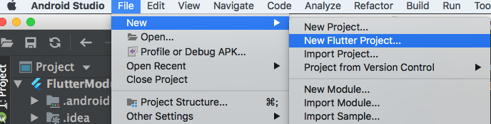
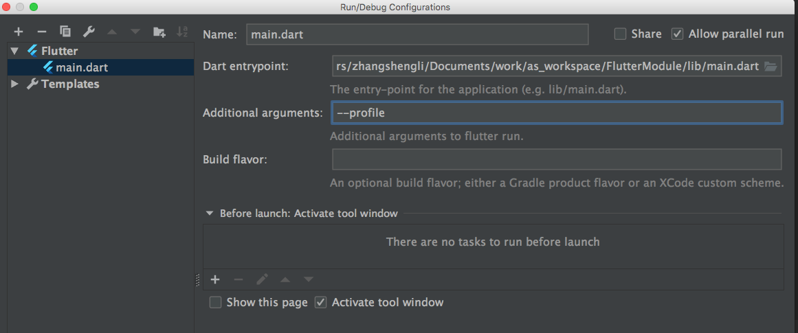

# Flutter

[TOC]

- 创建项目

  ```
  在 Terminal 中执行以下命令或在 Android Studio 中新建 Flutter 工程
  flutter create -t module my_flutter
  ```

  

- 目录结构

  ```
  ├── README.md
  ├── lib
  │   └── main.dart
  ├── pubspec.yaml
  └── test
      └── widget_test.dart
  ```

- 运行

  ```
  flutter run
  ```

- 更新依赖

  ```
  flutter packages get
  ```

- 其他

  - android 下 debug 模式比较卡，可以在运行配置项中添加 build 参数指定版本 --profile --release

    

- 自定义字体

  ```
   // 编辑 pubspec.yaml 文件,再修改字体的 sytle,设置 fontFamily
   fonts:
     - family: Schyler
       fonts:
         - asset: fonts/Schyler-Regular.ttf
         - asset: fonts/Schyler-Italic.ttf
           style: italic
     - family: Trajan Pro
       fonts:
         - asset: fonts/TrajanPro.ttf
         - asset: fonts/TrajanPro_Bold.ttf
           weight: 700
  ```

- rxdart 响应式编程库

- 


## 问题

- Could not find an option named "track-widget-creation"

  > 删除 flutter/packages/flutter_tools/gradle/flutter.gradle里
  >
  > if (trackWidgetCreation) { 
  >
  > ​     args "--track-widget-creation" 
  >
  >  } 
  >
  > <https://github.com/flutter/flutter/issues/20260>

- 图片列表内存占用过高 

- flutter: The following NoSuchMethodError was thrown during performLayout():

  flutter: The getter 'key' was called on null.

  flutter: Receiver: null

  flutter: Tried calling: key

  > itemBuilder  需要 return 返回 


## 相关站点

1. [Flutter中文网](https://flutterchina.club/)
2. [Flutter  入门电子书](https://book.flutterchina.club/)
3. [Dart 语法](https://dart.dev/tutorials/language)
4. [Dart 规范案例](https://www.kancloud.cn/marswill/effective_dart/728173)
5. [常用控件](https://github.com/yang7229693/flutter-study)


