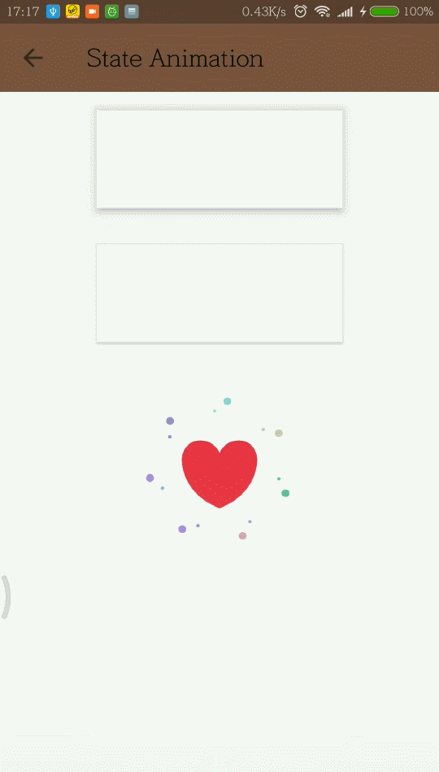
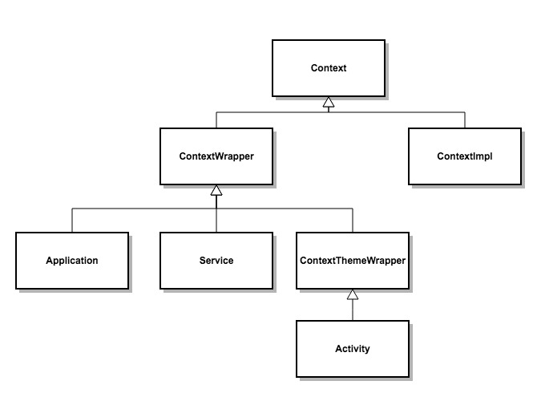
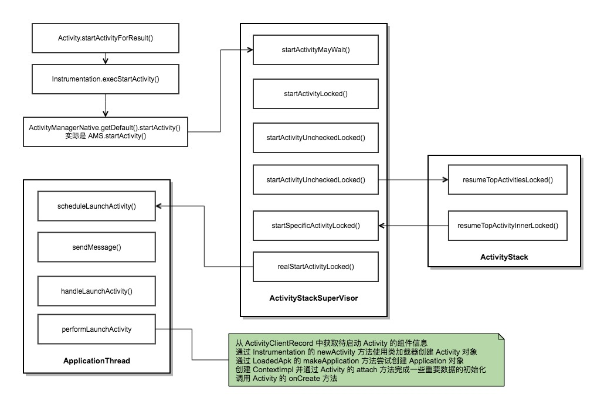
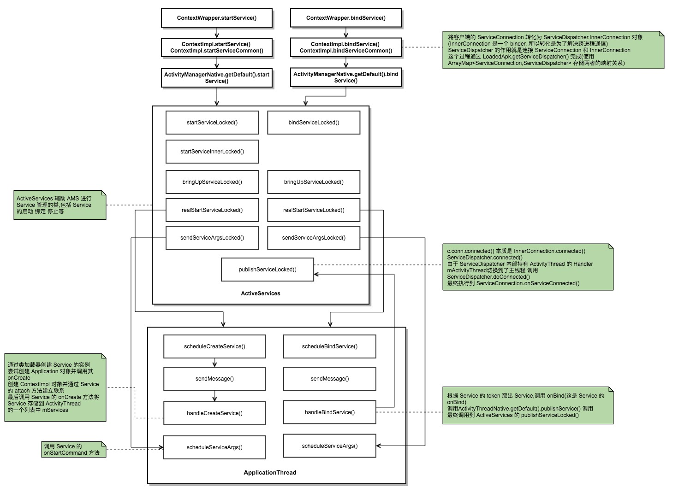

# 问题

[TOC]

## Java 是解释执行的？

## Reachability Fence 栅栏、围栏

## PhantomReference 幻象引用（虚引用）

## 引用队列 ReferenceQueue

创建各种引用并关联到响应对象时，JVM 会在特定时机将引用 enqueue到队列里(发生在 finalize 之后) 

```java
Object counter = new Object();
//引用队列
ReferenceQueue refQueue = new ReferenceQueue<>();
//创建一个关联引用队列的PhantomReference
PhantomReference<Object> p = new PhantomReference<>(counter, refQueue);
counter = null;
//在对象被GC的同时，会把该对象的包装类即 PhantomReference 放入到 ReferenceQueue 里面
System.gc();
try {
    // Remove 是一个阻塞方法，可以指定 timeout，或者选择一直阻塞
    Reference<Object> ref = refQueue.remove(1000L);
    if (ref != null) {
        // do something
    }
} catch (InterruptedException e) {
    // Handle it
}
```


## Java 判断中的赋值操作在 Kotlin 中的实现 

中间变量保存取出的值即可 

java

```java
int cnt = 0;
WeakReference<byte[]> k;
while((k = (WeakReference) rq.remove()) != null) {
System.out.println((cnt++) + "回收了:" + k);
}
```

kotlin

```kotlin
var cnt = 0
var reference = rq.remove()
while (reference!=null){
println(cnt++.toString() + "回收了:" + reference)
reference = rq.remove()
}
```

## 什么是语法糖？

语法糖(Syntactic sugar),是由Peter J. Landin(和图灵一样的天才人物，是他最先发现了Lambda演算，由此而创立了函数式编程)创造的一个词语，它意指那些没有给计算机语言添加新功能，而只是对人类来说更“甜蜜”的语法。

## 说说 collection 里面有什么子类?

list set queue/deque

map 不是 collection 的子类，map 是个接口

常用 list ArrayList LinkedList Vector

常用 set HashSet LinkedHashSet TreeSet(是一个 SortedSet)

## 什么场景下使用 list set map 呢?

即各自的优缺点是什么

## 需要实现一个`云计算任务调度系统，希望可以保证 VIP 客户的任务被优先处理，你可以利用哪些数据结构或者标准的集合类型呢？`

## 什么是 raw type? 什么是 ParameterizedType?

规定了泛型,引用的使用却没有指明.

ParameterizedType 表示参数化类型,也就是泛型,如 `List<T>`  `Set<T>` 

## 什么是 ANR 如何避免它

1. 什么情况下出现 ANR

   Application Not Responding, 主线程在规定时间内没有处理完相应工作,就会出现 ANR 

   | 组件              | 前台 |
   | ----------------- | ---- |
   | Activity          | 5s   |
   | BroadcastReceiver | 10s  |
   | Service           | 20s  |

2. ANR 机制的原理

   在进行相关操作时调用 hander.sendMessageAtTime() 发送 ANR 消息,在操作结束后 remove 该条消息,如果该操作在规定时间没有执行完成,则 message 就会被 handler 取出并执行,就发生了 ANR

3. 如何分析 ANR 问题

   一般情况的原因大致一下几点

   1. 主线程在做一些耗时操作
   2. 主线程被其他线程锁
   3. cpu 被其他进程占用,该进程没被分配足够的 cpu 资源

   首先看系统log, 再者就是看 trace 信息 /data/anr/traces.txt

4. 如何避免 ANR 或者 卡顿 问题

   - IPC 操作
     - 尽量将 IPC 操作异步化
     - 减少 IPC 操作的频率,不要频繁调用,避免重复调用
     - 缓存 IPC 固定值或中间值 如: IMEI MAC SimpleDateFormat
     - 用 Messenger 代替 AIDL
   -  主线程 IO
     - 主线程读,写
     - 解压文件,获取文件 MD5,SHA1值等
     - 主线程解析文件(xml,json 等)
     - 主线程删除目录
   - 线程问题
     - 最好不要新增线程,使用线程池
     - 对线程优先级分类,所有线程的优先级设置都比 UI 线程低
     - 存在多线程访问的类,耗时的模块不要采用加锁的方式,避免阻塞其他线程
     - 禁止主线程主动挂起,等待: wait,join
     - 所有线程设置名字,方便定位日志
   - 内存问题
     - 内存抖动:复杂界面异步化,分步化
     - 低内存:图片制作,界面元素及层级优化等节约内存
     - 内存泄漏
       - 注册监听静态类事件,但是忘记移除监听 CoreManager.addClient(this),建议使用弱引用存储事件监听者
       - 不要滥用内部匿名类,特别是将内部匿名类设置给静态对象持有
       - ImageManager ScheduleTask 等提交的异步任务,在模块退出及不关心时,将 Listener 移除掉,特别是 Listener 为内部匿名类时

5. ANR 问题监控方案

   1. 工具使用 
      1. TraceView 
      2. Systrace sdk/platform-tools/systrace [使用](https://blog.csdn.net/kitty_landon/article/details/79192377)
      3. StrictMode
   2. 打点统计 耗时/帧率
   3. 全局监控
      1. 用户反馈分析
      2. ANR 日志分析
      3. Strict ANR 日志分析

## Activity 和 Fragment 生命周期有哪些?


> Though a Fragment's lifecycle is tied to its owning activity, it has its own wrinkle on the standard activity lifecycle. It includes basic activity lifecycle methods such as `onResume()`, but also important are methods related to interactions with the activity and UI generation.
>
> The core series of lifecycle methods that are called to bring a fragment up to resumed state (interacting with the user) are:
>
> 1. `onAttach(Activity)` called once the fragment is associated with its activity.
> 2. `onCreate(Bundle)` called to do initial creation of the fragment.
> 3. `onCreateView(LayoutInflater, ViewGroup, Bundle)` creates and returns the view hierarchy associated with the fragment.
> 4. `onActivityCreated(Bundle)` tells the fragment that its activity has completed its own `Activity.onCreate()`.
> 5. `onViewStateRestored(Bundle)` tells the fragment that all of the saved state of its view hierarchy has been restored.
> 6. `onStart()` makes the fragment visible to the user (based on its containing activity being started).
> 7. `onResume()` makes the fragment begin interacting with the user (based on its containing activity being resumed).
>
> As a fragment is no longer being used, it goes through a reverse series of callbacks:
>
> 1. `onPause()` fragment is no longer interacting with the user either because its activity is being paused or a fragment operation is modifying it in the activity.
> 2. `onStop()` fragment is no longer visible to the user either because its activity is being stopped or a fragment operation is modifying it in the activity.
> 3. `onDestroyView()` allows the fragment to clean up resources associated with its View.
> 4. `onDestroy()` called to do final cleanup of the fragment's state.
> 5. `onDetach()` called immediately prior to the fragment no longer being associated with its activity.

[Fragment 学习资料](https://github.com/Ztiany/Programming-Notes/blob/master/Android/Fragment/Fragment%E5%AD%A6%E4%B9%A0%E8%B5%84%E6%96%99.md)

## inflate 后两个参数的作用

| root     | attachToRoot |                                                              |
| -------- | ------------ | ------------------------------------------------------------ |
| non-null | true         | 布局添加到 root 中,且添加过程中布局根节点的属性都是有效的    |
| non-null | false        | 布局不会添加到 root 中,且添加过程中布局根节点的属性都是有效的 |
| null     | true         | 不会添加到任何布局中,且根节点的布局参数失效                  |
| null     | false        | 不会添加到任何布局中,且根节点的布局参数失效                  |

## 横竖屏切换时 Activity 的生命周期

横竖屏切换会执行各生命周期

## AsyncTask 的缺陷和问题

1. AsyncTask 是什么

   系统提供的轻量级异步任务类,本质是线程池和 handler 的封装

2. 使用方式

   三个参数(开始任务传的参数类型,进度值类型,返回值类型),

   五个方法 onPreExecute doInBackground onProgressUpdate onPostExecute onCancelled

   默认是串行处理,如果需要并行,调用executeOnExector

3. 内部原理

4. 注意事项

   1. 必须在主线程创建,必须在主线程调用 execute (官方文档是这么说的,测试中并没有发现问题)

      因为sHandler 是一个静态 Handler, 为了能够将执行环境切换到主线程,这就要求 sHandler 这个对象必须在主线程中创建,由于静态变量会在加载类的时候初始化,因此这就变相要求 AsyncTask 必须在主线程中加载(开发艺术探索原文)???

   2. 不要手动调用回调的方法

   3. 不能在 doInBackgroud 中刷新 UI

   4. 一个任务实例只能执行一次,如果执行第二次会抛出异常

5. 不足

   不适合执行特别耗时的任务

## onSaveInstanceState 与 onRestoreInstanceState

保存和恢复界面信息,用户或开发者主动销毁一个 Activity 时不会调用,其他情况都会调用

## android 中进程的优先级

1. **前台进程** 用户正在与该进程进行交互操作
   1. 用户正在与其交互的 Activity
   2. 有一个和用户正在交互的 Activity 绑定的 Service
   3. 有一个前台运行模式的 Service(Service 调用了 startForeground)
   4. 有一个正在执行生命周期方法的 Service
   5. 有一个正在执行 onReceive 方法的 BroadcastReceiver
2. **可见进程** 没有任何前台组件,但是可以影响用户看到的界面
   1. 有一个非前台的 Activity(调用了 onPause)
   2. 有一个与可见(或前台) Activity 绑定的 Service
3. **服务进程** 除了复合前台进程和可见进程条件的 Service, 其它的 Service 都被归类为服务进程
4. **后台进程** 持有不可见 Activity( 调用了 onStop)
5. **空进程**

## Serializable 和 Parcelable

**Serializable** 是 java 提供的序列化接口,支持存储本地,网络传输等场景,强烈建议声明序列化标识 serialVersionUID

可以实现 writeReplace writeObject readObject readResolve 方法自定义序列化行为

**Parcelable** 是 android 提供的序列化接口.只支持在内存场景中传递,因为 Serializable 在内存序列化上开销比较大,所以推荐使用 Parcelable,据说可以快10倍

## 动画

1. **视图动画** 仅仅是动 View 绘制的地方,真正的位置并没有发生变化

   1. 补间动画 平移 旋转 缩放 透明度 或前几者的交集
   2. 帧动画 (设备开关机 复杂动画效果 要防止 OOM,不过建议使用 Gif)

   场景:

   PopupWindow 设置显示隐藏的动画效果

   Activity Fragment 转场动画效果

   ViewGroup 设置子控件的进场动画效果

2. **属性动画** 任何提供了 Getter Setter 方法的对象属性上

   场景:

   视图动画作用在View 上的动画效果,属性动画都可以实现

   在自定义 View 时,需要实现的一些复杂动画效果,或对 View 的一些特殊属性值进行动画变更时,视图动画无法实现时

   也可以用在非动画场景,比如在自定义 View 时需要一个有一定规律(根据特定差值器变化)且可鉴定的数值变化器,这个时候借助属性动画是再适合不过了

3. **其他**

   1. 触摸反馈动画 (Ripple Effect)

   2. 揭露动画 (Reveal Effect)

   3. 转场动画 & 共享元素

      共享元素效果

       

   4. 视图状态动画

      如 Selector 背景效果 View 状态改变时,显示效果和静态效果的区分,比如 Z轴抬高,大小改变等

      

   5. 矢量动画

      

   6. 关键帧动画

      

   **视图动画和属性动画对比**

   视图动画

   1. 视图动画只能为 View 添加动画效果,且不能监听 View 相关属性的变化过程
   2. 提供的动画能力较为单一,目前仅支持帧动画,平移 旋转 缩放 透明度 及这些集合
   3. 只改变了绘制效果,真正位置和相关属性并不会改变,所以点击事件的触发区域有问题

   属性动画

   1. 作用对象不局限在 View 上,而是任何提供了 Getter Setter 方法的对象属性上
   2. 没有直接改变 View 状态的能力,而是通过改变 View 相关属性的方式来改变 View 的显示效果
   3. 使用更方便,但是上手难度较高,对于 propertyName 需要自己去挖掘
   4. 是在3.0以上系统提供的能力,在3.0以下需要导入 nineoldandroids 解决兼容性问题

   相关文章 [简介](https://blog.csdn.net/shedoor/article/details/81251849#1)    [详解](https://github.com/OCNYang/Android-Animation-Set)

## Context 相关

1. 类图结构

   

2. 使用对比

   |                          | Application | Activity | Service | Content provider | BroadcastReceiver |
   | ------------------------ | ----------- | -------- | ------- | ---------------- | ----------------- |
   | show dialog              | ❌           | ✔️        | ❌       | ❌                | ❌                 |
   | start activity           | ❌1          | ✔️        | ❌1      | ❌1               | ❌1                |
   | layout inflation         | ❌2          | ✔️        | ❌2      | ❌2               | ❌2                |
   | start service            | ✔️           | ✔️        | ✔️       | ✔️                | ✔️                 |
   | bind to service          | ✔️           | ✔️        | ✔️       | ✔️                | ❌                 |
   | send broadcast           | ✔️           | ✔️        | ✔️       | ✔️                | ✔️                 |
   | regist BroadcastReceiver | ✔️           | ✔️        | ✔️       | ✔️                | ❌3                |
   | load resouce             | ✔️           | ✔️        | ✔️       | ✔️                | ✔️                 |

   注意:

   数字1 启动 activity 在这些类中式可以的,但是需要创建一个新的 task, 一般不推荐

   数字2 在这些类中使用 layout inflate 是合法的,但是会使用默认的系统主题样式,如果你定义了某些样式可能不会被使用

   数字3 在 receiver 为 null 允许,在4.2或以上的版本中,用于获取粘性广播的当前值

   **总结**: 和 UI 相关的方法都应该使用 Activity 作为 context.注意 Context 引用的持有,防止内存泄漏

   Context 个数 = Activity 个数 + Service 个数 + 1个Application

## Android 各版本新特性

| Platform Version                                             | API Level                                                    | VERSION_CODE                                                 | Notes                                                        |
| ------------------------------------------------------------ | ------------------------------------------------------------ | ------------------------------------------------------------ | ------------------------------------------------------------ |
| [Android 9](../../../about/versions/pie/index.html)          | [28](https://developer.android.com/sdk/api_diff/28/changes.html) | [`P`](../../../reference/android/os/Build.VERSION_CODES.html#P) | [Platform Highlights](../../../about/versions/pie/android-9.0.html) |
| [Android 8.1](../../../about/versions/oreo/android-8.1.html) | [27](https://developer.android.com/sdk/api_diff/27/changes.html) | `O_MR1`                                                      | [Platform Highlights](../../../about/versions/oreo/android-8.1.html) |
| [Android 8.0](../../../about/versions/oreo/index.html)       | [26](https://developer.android.com/sdk/api_diff/26/changes.html) | `O`                                                          | [Platform Highlights](../../../about/versions/oreo/android-8.0.html) |
| [Android 7.1.1 Android 7.1](../../../about/versions/nougat/android-7.1.html) | [25](https://developer.android.com/sdk/api_diff/25/changes.html) | `N_MR1`                                                      | [Platform Highlights](../../../about/versions/nougat/index.html) |
| [Android 7.0](../../../about/versions/nougat/android-7.0.html) | [24](https://developer.android.com/sdk/api_diff/24/changes.html) | `N`                                                          | [Platform Highlights](../../../about/versions/nougat/index.html) |
| [Android 6.0](../../../about/versions/marshmallow/android-6.0.html) | [23](https://developer.android.com/sdk/api_diff/23/changes.html) | `M`                                                          | [Platform Highlights](../../../about/versions/marshmallow/index.html) |
| [Android 5.1](../../../about/versions/android-5.1.html)      | [22](https://developer.android.com/sdk/api_diff/22/changes.html) | `LOLLIPOP_MR1`                                               | [Platform Highlights](../../../about/versions/lollipop.html) |
| [Android 5.0](../../../about/versions/android-5.0.html)      | [21](https://developer.android.com/sdk/api_diff/21/changes.html) | `LOLLIPOP`                                                   |                                                              |
| Android 4.4W                                                 | [20](https://developer.android.com/sdk/api_diff/20/changes.html) | `KITKAT_WATCH`                                               | KitKat for Wearables Only                                    |
| [Android 4.4](../../../about/versions/android-4.4.html)      | [19](https://developer.android.com/sdk/api_diff/19/changes.html) | `KITKAT`                                                     | [Platform Highlights](../../../about/versions/kitkat.html)   |
| [Android 4.3](../../../about/versions/android-4.3.html)      | [18](https://developer.android.com/sdk/api_diff/18/changes.html) | `JELLY_BEAN_MR2`                                             | [Platform Highlights](../../../about/versions/jelly-bean.html) |
| [Android 4.2, 4.2.2](../../../about/versions/android-4.2.html) | [17](https://developer.android.com/sdk/api_diff/17/changes.html) | `JELLY_BEAN_MR1`                                             | [Platform Highlights](../../../about/versions/jelly-bean.html#android-42) |
| [Android 4.1, 4.1.1](../../../about/versions/android-4.1.html) | [16](https://developer.android.com/sdk/api_diff/16/changes.html) | `JELLY_BEAN`                                                 | [Platform Highlights](../../../about/versions/jelly-bean.html#android-41) |
| [Android 4.0.3, 4.0.4](../../../about/versions/android-4.0.3.html) | [15](https://developer.android.com/sdk/api_diff/15/changes.html) | `ICE_CREAM_SANDWICH_MR1`                                     | [Platform Highlights](../../../about/versions/android-4.0-highlights.html) |
| [Android 4.0, 4.0.1, 4.0.2](../../../about/versions/android-4.0.html) | [14](https://developer.android.com/sdk/api_diff/14/changes.html) | `ICE_CREAM_SANDWICH`                                         |                                                              |
| [Android 3.2](../../../about/versions/android-3.2.html)      | [13](https://developer.android.com/sdk/api_diff/13/changes.html) | `HONEYCOMB_MR2`                                              |                                                              |
| [Android 3.1.x](../../../about/versions/android-3.1.html)    | [12](https://developer.android.com/sdk/api_diff/12/changes.html) | `HONEYCOMB_MR1`                                              | [Platform Highlights](../../../about/versions/android-3.1-highlights.html) |
| [Android 3.0.x](../../../about/versions/android-3.0.html)    | [11](https://developer.android.com/sdk/api_diff/11/changes.html) | `HONEYCOMB`                                                  | [Platform Highlights](../../../about/versions/android-3.0-highlights.html) |
| [Android 2.3.4 Android 2.3.3](../../../about/versions/android-2.3.3.html) | [10](https://developer.android.com/sdk/api_diff/10/changes.html) | `GINGERBREAD_MR1`                                            | [Platform Highlights](../../../about/versions/android-2.3-highlights.html) |
| [Android 2.3.2 Android 2.3.1 Android 2.3](../../../about/versions/android-2.3.html) | [9](https://developer.android.com/sdk/api_diff/9/changes.html) | `GINGERBREAD`                                                |                                                              |
| [Android 2.2.x](../../../about/versions/android-2.2.html)    | [8](https://developer.android.com/sdk/api_diff/8/changes.html) | `FROYO`                                                      | [Platform Highlights](../../../about/versions/android-2.2-highlights.html) |
| [Android 2.1.x](../../../about/versions/android-2.1.html)    | [7](https://developer.android.com/sdk/api_diff/7/changes.html) | `ECLAIR_MR1`                                                 | [Platform Highlights](../../../about/versions/android-2.0-highlights.html) |
| [Android 2.0.1](../../../about/versions/android-2.0.1.html)  | [6](https://developer.android.com/sdk/api_diff/6/changes.html) | `ECLAIR_0_1`                                                 |                                                              |
| [Android 2.0](../../../about/versions/android-2.0.html)      | [5](https://developer.android.com/sdk/api_diff/5/changes.html) | `ECLAIR`                                                     |                                                              |
| [Android 1.6](../../../about/versions/android-1.6.html)      | [4](https://developer.android.com/sdk/api_diff/4/changes.html) | `DONUT`                                                      | [Platform Highlights](../../../about/versions/android-1.6-highlights.html) |
| [Android 1.5](../../../about/versions/android-1.5.html)      | [3](https://developer.android.com/sdk/api_diff/3/changes.html) | `CUPCAKE`                                                    | [Platform Highlights](../../../about/versions/android-1.5-highlights.html) |
| [Android 1.1](../../../about/versions/android-1.1.html)      | 2                                                            | `BASE_1_1`                                                   |                                                              |
| Android 1.0                                                  | 1                                                            | `BASE`                                                       |                                                              |

- 5.0 新特性
  - MaterialDesign 设计风格
  - 支持多种设备
  - 支持64位ART虚拟机
- 6.0 新特性
  - 动态权限管理
  - 支持快速充电的切换
  - 支持文件夹拖拽应用
  - 相机新增专业模式
- 7.0 新特性
  - 分屏多任务
  - 增强的Java8语言模式
  - 夜间模式
- 8.0 新特性
  - 画中画
  - 通知标志
  - 自动填充框架
  - 系统优化
  - 后台限制
  - 等等优化很多

## 全局 Dialog 实现方式

1. 利用系统 dialog

   ```java
   dialog.getWindow().setType(WindowManager.LayoutParams.TYPE_SYSTEM_ALERT);
   ```

   AndroidManifest.xml 中加入 android.permission.SYSTEM_ALERT_WINDOW

   其中 dialog 的 context 必须为 ApplicationContext,且6.0及以上系统需要悬浮窗 权限

2. 使用 WindowManger 直接添加 View

   ```java
   wm = (WindowManager) getApplicationContext().getSystemService(
                   Context.WINDOW_SERVICE);
   wm.addView(btn_floatView, params);
   ```

   需要悬浮窗权限

3. 使用 Activity

   1. 设置 Activity 为透明的,然后弹 dialog 或 DialogFragment
   2. 设置 Activity 的主题为 dialog

## 更新 UI 的方式

切换线程的原理分别是什么?

- Activity.runOnUiThread
- View.post
- Handler
- AsyncTask
- Rxjava
- LiveData

## 四大组件

### Activity 深入解析

Activity 对象是在何时创建的, onCreate 方法有在何时被回调?

以5.0系统为例



### Service 深入解析

Service 两种方式的启动过程



### BroadcastReceiver 深入解析

### ContentProvider 深入解析

## xml解析

|      | 优点                                      | 缺点                                                         | 场景               |
| ---- | ----------------------------------------- | ------------------------------------------------------------ | ------------------ |
| DOM  | 可以对文档进行修改,灵活性高               | 需要将整个文档读入内存,占用资源                              | 需要对文档进行修改 |
| SAX  | 不必解析整个文档,可以根据自身需求获取数据 | 需要自己编写事件逻辑,使用麻烦,并且不能同时访问文档的不同部分,只要开始解析,就必须解析完成 | 大文档的解析       |
| PULL | 不用写事件逻辑                            | 对文档进行修改困难,随时可以跳出循环结束解析                  | 大文档的解析       |

**DOM**

```java
DocumentBuilderFactory factory = DocumentBuilderFactory.newInstance();
        try {
            DocumentBuilder builder = factory.newDocumentBuilder();
            //从assets目录获取xml文档输入流
            AssetManager assets = getAssets();
            InputStream is = assets.open("text.xml");
            //通过 builder.parse(is)方法获取一个document实例
            Document document = builder.parse(is);
            //根节点相关
            Element element = document.getDocumentElement();//获取当前xml文档的所有信息
            element.getTagName();//返回根节点的名称,这里为:note
            element.getAttribute("name");//根据根节点的属性名返回属性值,这里为:rqq
            //子节点相关
            NodeList nodeList = element.getElementsByTagName("*");//根据子节点的节点名返回一个节点列表,如果填写"*",则返回所有节点的列表信息
            nodeList.item(0).getNodeName();//返回第0个位置子节点的节点名,这里为:to
            nodeList.item(0).getTextContent();//返回第0个位置子节点里的文本内容,不是属性值,这里为:George
            nodeList.item(0).getParentNode();//返回第0个位置子节点的父节点,因各种原因找不到父节点则返回null,这里为:note
            nodeList.item(0).getChildNodes();//返回第0个位置子节点包含的所有子节点列表信息,没有子节点,也会返回一个NodeList,只不过长度为0,这里当前的子节点<span style="white-space:pre">					</span>     //下面已经没有子节点了,所以返回的NodeList长度为0
            NamedNodeMap map = nodeList.item(0).getAttributes();//获取第0个位置子节点所有的属性集合,这里只有1个属性,即id
            String nodeValue = map.item(0).getNodeValue();//获取第0个位置子节点的第0个位置属性的属性值,这里为:1
            /*
            * //也可通过下面的方式获取
            * //因为Element是Node的子类,所以可以把Node强转为Element
            * Element element1 = (Element) nodeList.item(0);
            * //然后通过Element拿到该子节点的各种属性值
            * element1.getAttribute("id");//获取该子节点的id属性
            * //因为Element继承自Node,所以Element可以使用父类即Node类的所有的public方法,如下:
            * element1.getNodeName();
            * element1.getTextContent();
            * element1.getParentNode();
            * element1.getChildNodes();
            *
            * */
 
        } catch (ParserConfigurationException e) {
            e.printStackTrace();
        } catch (IOException e) {
            e.printStackTrace();
        } catch (SAXException e) {
            e.printStackTrace();
        }
```

**SAX**

sax 解析需要继承 DefaultHandler,然后重写一些方法

```java
  /**
     * sax解析
     */
    public void SaxParse(View view) {
        SAXParserFactory factory = SAXParserFactory.newInstance();
        try {
            SAXParser saxParser = factory.newSAXParser();
            AssetManager assets = getAssets();
            InputStream is = assets.open("text.xml");
            saxParser.parse(is, new SaxParseUtils());
        } catch (ParserConfigurationException e) {
            e.printStackTrace();
        } catch (SAXException e) {
            e.printStackTrace();
        } catch (IOException e) {
            e.printStackTrace();
        }
    }
```

```java
public class SaxParseUtils extends DefaultHandler {
    public SaxParseUtils() {
 
    }
 
    /**
     * 文档开始解析时调用
     *
     * @throws SAXException
     */
    @Override
    public void startDocument() throws SAXException {
        System.out.println("文档开始解析...");
    }
 
    /**
     * 相当于一个循环,从根节点开始,每读到一个新的节点,
     * 便执行一次这个方法,然后把该节点里的所有属性都存到Attributes里,
     *
     * @param uri        xml文档的uri地址,这里直接传入的是inputStream,所以uri为空
     * @param localName  本地名,一般和qName相同
     * @param qName      节点名
     * @param attributes 当前节点下的所有属性都存放到该参数里了
     * @throws SAXException 包含任何sax解析的异常
     */
    @Override
    public void startElement(String uri, String localName, String qName, Attributes attributes) throws SAXException {
        System.out.println(qName + "节点开始读取");
        attributes.getLength();//获取属性数量
        String value = attributes.getValue(0);//也可根据索引号获取属性值,这里只有id一个属性,所以索引为0
        String QName = attributes.getQName(0);
        System.out.println("节点名: " + qName + ",属性名: " + QName + ",属性值: " + value + ";");
        //System.out.println("uri: " + uri + "," + "localName: " + localName + "," + "qName: " + qName + "," + "attributes: " + attributes + ";");
    }
 
    /**
     * 文档解析完毕时调用
     *
     * @throws SAXException
     */
    @Override
    public void endDocument() throws SAXException {
        System.out.println("文档解析结束...");
    }
 
    /**
     * 该方法里存放的是每个节点里的文本内容,文本内容存到ch数组里,
     *
     * @param ch     用来存放每个节点里的文本内容
     * @param start  文本内容是从哪开始的,如果文本内容前面有1个空格,则start为1,如果没有空格,则start为0
     * @param length ch数组的长度,包含空格
     * @throws SAXException 各种sax解析异常
     */
    @Override
    public void characters(char[] ch, int start, int length) throws SAXException {
        String data = new String(ch, start, length);
        if (!data.trim().equals(""))
            System.out.println("该节点存放的文本内容: " + data);
        //System.out.println("ch: " + ch + "," + "start: " + start + "," + "length: " + length + ";");
 
    }
 
    /**
     * 每个节点读取完毕时调用
     *
     * @param uri       xml文档的uri地址,也可以为url,这里直接传入的是inputStream,所以uri为空
     * @param localName 本地名,一般和qName相同
     * @param qName     节点名
     * @throws SAXException 各种sax解析异常
     */
    @Override
    public void endElement(String uri, String localName, String qName) throws SAXException {
        //System.out.println("uri: " + uri + "," + "localName: " + localName + "," + "qName: " + qName + ";");
        System.out.println(qName + "节点读取完毕-----------");
 
    }
 
    /**
     * 文档解析发生错误时调用
     *
     * @param e 具体的异常信息
     * @throws SAXException 各种sax解析异常
     */
    @Override
    public void error(SAXParseException e) throws SAXException {
        System.out.println("文档解析错误: " + e);
 
    }
}
```

**PULL**

获取到 eventType, 循环解析

```java
/**
     * pull解析
     */
    public void PullParse(View view) {
        try {
            XmlPullParserFactory factory = XmlPullParserFactory.newInstance();
            XmlPullParser pull = factory.newPullParser();
            AssetManager assets = getAssets();
            InputStream is = assets.open("text.xml");
            pull.setInput(is, "utf-8");
            int eventType = pull.getEventType();
            while (eventType != XmlPullParser.END_DOCUMENT) {
                switch (eventType) {
                    case XmlPullParser.START_DOCUMENT:
                        System.out.println("pull开始解析文档...");
                        break;
                    case XmlPullParser.START_TAG:
                        System.out.println("读取到节点: " + pull.getName() +
                                ",属性名:" + pull.getAttributeName(0) +
                                ",属性值:" + pull.getAttributeValue(0));
                        break;
                    case XmlPullParser.TEXT:
                        if (!pull.getText().trim().equals(""))
                            System.out.println("读取到的文本内容:" + pull.getText());
                        break;
                    case XmlPullParser.END_TAG:
                        System.out.println(pull.getName() + "节点读取完毕-------");
                        break;
                }
                eventType = pull.next();//这是关键,不然循环没有意义
            }
            System.out.println("pull解析文档完毕...");
        } catch (XmlPullParserException e) {
            e.printStackTrace();
        } catch (IOException e) {
            e.printStackTrace();
        }
    }
}
```

## 内存泄漏

内存不在 GC 掌控之内,本该被回收的对象不能被回收

**排查内存泄漏**

- 下载 [MAT](<https://www.eclipse.org/mat/downloads.php>)

- 导出 Android Studio profile 中的 dump 文件,进行转换 `hprof-conv input.hprof output.hprof`
- 终端执行 `/Applications/mat.app/Contents/MacOS/MemoryAnalyzer output.hprof` [MAT 使用教程](https://blog.csdn.net/wanghao200906/article/details/79305126) 

## merge 标签

优化 UI 的层次结构.本质上是将子布局添加到父布局上

**限制**:

1. merge 必须是根节点
2. 当 inflate 一个merge 标签开的布局文件时,必须指定一个 parent ViewGroup, 并且 attachToRoot 为 true

## Handler

Handler 的运行需要底层 MessageQueue 和 Looper 的支撑.发送消息的过程其实是MessageQueue 中添加一条消息,MessageQueue 的 next 方法返回这条消息给 Looper,Looper 收到消息开始处理,最终消息交给 Handler 处理, Handler 的 dispatchMessage 被调用,进入消息处理阶段

Handler 在创建的时候回采用当前线程的 Looper 来构造消息系统.线程默认是没有 Looper 的.ActivityThread 创建的时候默认就会初始化 Looper.子线程中 Looper.prepare() 进行初始化, Looper.loop() 开启循环

- **MessageQueue** 单链表的数据结构来存储消息列表

  工作原理:

  主要是插入 enqueueMessage 和读取 next 两个操作,next 是一个无限循环,如果队列里没有消息,会一直阻塞,next 方法会返回一条消息并将其从链表里删除

- **Looper** 无限循环的方式去询问是否有新消息

  工作原理:

  loop 方法开启循环,只有当 MessageQueue 的 next 方法返回 null 时才会终止,否则就会阻塞或处理消息

  quit 和 quitSafely 会通知 MessageQueue 退出,则 MessageQueue 的 next 就会返回 null,且 Handler 的 sendMessage 也会返回 false, 发送消息失败

- **ThreadLocal** 保存当前线程的 Looper

  工作原理:

  每个线程都有一个threadLocals ThreadLocalMap类型的变量, ThreadLocal 存取就是先从 Thread 身上取出这个 map, 然后进行存取操作,实现线程范围内的数据共享

  ```java
  public void set(T var1) {
          Thread var2 = Thread.currentThread();
          ThreadLocal.ThreadLocalMap var3 = this.getMap(var2);
          if (var3 != null) {
              var3.set(this, var1);
          } else {
              this.createMap(var2, var1);
          }
      }
      
  ThreadLocal.ThreadLocalMap getMap(Thread var1) {
          return var1.threadLocals;
      }
  ```

